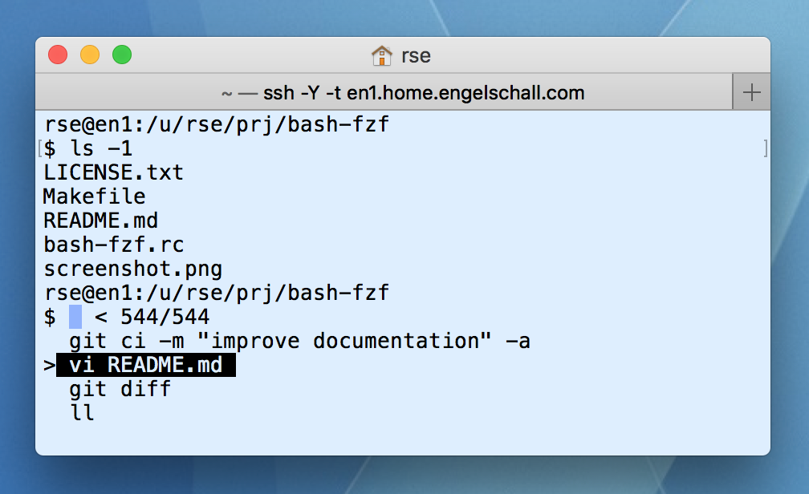

bash-fzf
========

### Enhance GNU Bash with FZF Matching



About
-----

This is an elaborated [GNU Bash](https://www.gnu.org/software/bash/)
run-command script which enhances interactive shell sessions with the following features,
all based on the excellent [FZF](https://github.com/junegunn/fzf/) searching utility:

- **improved command history searching** with overwritten FZF-based `CTRL+r` functionality,
  based on the built-in `history` command and its underlying standard `$HOME/.bash_history` file.

- **additional command bookmarking** with new FZF-based `CTRL+b` (bookmark) functionality,
  based on a new `bookmark` command and its underlying custom
  `.bash_bookmark` files in current, parent and `$HOME` directories.

- **additional directory changing** with new FZF-based `CTRL+g` (goto) functionality,
  based on a new `cdpaths` command and its underlying custom
  `.bash_cdpaths` files in current, parent and `$HOME` directories.

- **improved directory changing** with an overwritten `cd` command, using
  the built-in `pushd` functionality and its built-in forward directory
  stack, plus the additional `cd -` (go backward in directory stack),
  and the additional `cd +` (go forward in directory stack) commands and
  its underlying custom reverse directory stack.

FZF Cheatsheet
--------------

In all FZF sessions, the following inputs are available:

- Searching: enter one or more words for searching through the list of
  shell commands. The words are AND-combined, i.e., all the words have to
  match. In case a word begins with `!`, it is negated, i.e., it has to
  NOT match.

- Editing: press `LEFT`/`RIGHT` for positioning the cursor on the line,
  press `CTRL+a` for jumping to the beginning of the line,
  press `CTRL+w` for deleting the word before the current cursor position,
  press `CTRL+k` for deleting everthing after the current cursor position.

- Selection: press `UP`/`DOWN` to select a command.

- Execution: press `RETURN` for terminating the FZF session and executing the selected command.

- Editing: press `CTRL+e` for termining the FZF session and picking up the selected command
  for subsequent editing on the shell prompt,

- Termination: press `CTRL+c`/`CTRL-g`/`ESC` for terminating the FZF session
  without executing any command at all.

For more details on the usage of the underlying FZF, please see
the [FZF documentation](https://github.com/junegunn/fzf/).

Usage
-----

```
source bash-fzf.rc
```

Hint
----

In practice, this optimally should be combined with
my [Unix dotfiles](https://github.com/rse/dotfiles)
project which provides a reasonable GNU Bash shell
environment. It automatically enables *bash-fzf* if you copy the
[bash-fzf.rc](https://github.com/rse/bash-fzf/blob/master/bash-fzf.rc)
script to `~/.bash-fzf.rc`.

History
-------

The functionality was orginally invented in 1997 and was originally
based on iselect(1), an interactive selection tool by the author, a
little bit similar to FZF but without the search functionality. In 2017
the functionality was migrated to the excellent FZF utility and the
result released as Open Source.

License
-------

Copyright (c) 1997-2020 Dr. Ralf S. Engelschall (http://engelschall.com/)

Permission is hereby granted, free of charge, to any person obtaining
a copy of this software and associated documentation files (the
"Software"), to deal in the Software without restriction, including
without limitation the rights to use, copy, modify, merge, publish,
distribute, sublicense, and/or sell copies of the Software, and to
permit persons to whom the Software is furnished to do so, subject to
the following conditions:

The above copyright notice and this permission notice shall be included
in all copies or substantial portions of the Software.

THE SOFTWARE IS PROVIDED "AS IS", WITHOUT WARRANTY OF ANY KIND,
EXPRESS OR IMPLIED, INCLUDING BUT NOT LIMITED TO THE WARRANTIES OF
MERCHANTABILITY, FITNESS FOR A PARTICULAR PURPOSE AND NONINFRINGEMENT.
IN NO EVENT SHALL THE AUTHORS OR COPYRIGHT HOLDERS BE LIABLE FOR ANY
CLAIM, DAMAGES OR OTHER LIABILITY, WHETHER IN AN ACTION OF CONTRACT,
TORT OR OTHERWISE, ARISING FROM, OUT OF OR IN CONNECTION WITH THE
SOFTWARE OR THE USE OR OTHER DEALINGS IN THE SOFTWARE.

